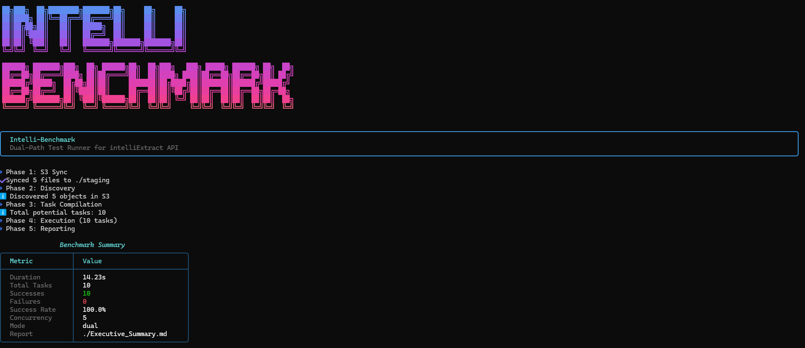
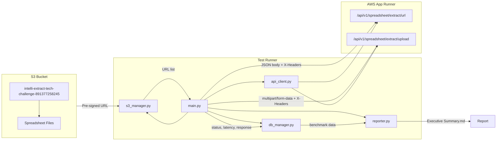
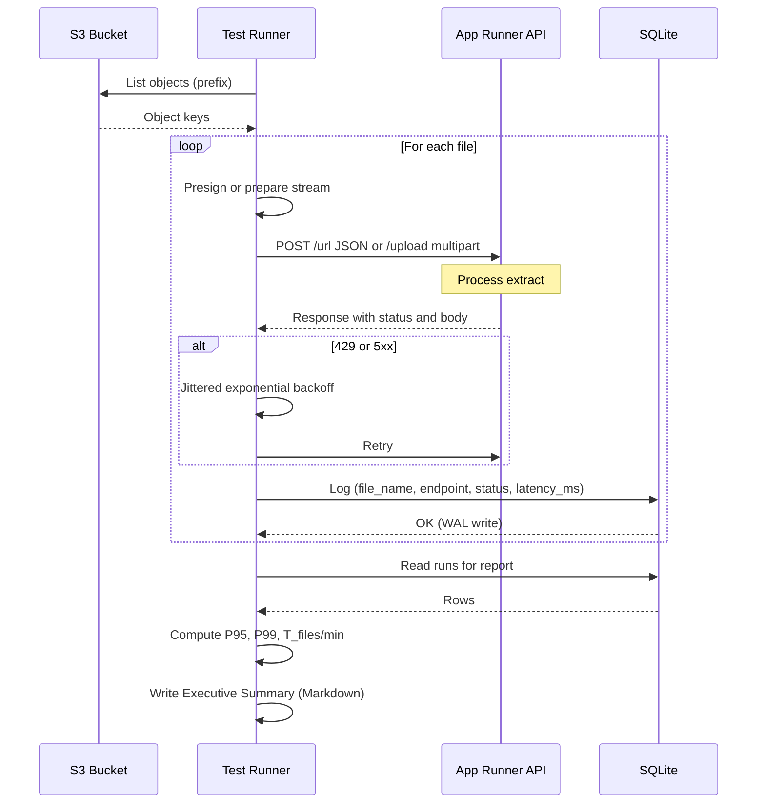

# Intelli-Benchmark

## Project Overview

**Intelli-Benchmark** is a dual-path benchmarking framework for testing the intelliExtract spreadsheet extraction API hosted on AWS App Runner. The intelliExtract service exposes two ways to submit a spreadsheet for extraction:

1. **URL path** — Client sends a pre-signed S3 URL (or public link); the service fetches the file.
2. **Upload path** — Client uploads the file as `multipart/form-data`.

The framework runs a **hybrid load test** (configurable 50/50 or custom split) against both paths to compare stability, latency, and throughput. Results are persisted in SQLite for resumability and for computing P95 latency and files-per-minute benchmarks. An **AI-driven Executive Summary** highlights anomalies and recommends which path performs better.

---

## CLI Preview



---

## Quick Start

A judge can run the full suite in three commands:

**Git Bash / Linux / macOS:**

```bash
# 1. Create virtualenv and install dependencies
python -m venv .venv && source .venv/Scripts/activate   # Git Bash (Windows)
# source .venv/bin/activate   # Linux/macOS
pip install -r requirements.txt

# 2. Configure credentials
# Option A: Create a .env file (recommended)
cp .env.example .env
# Edit .env with your keys

# Option B: Export env vars
export INTELLI_ACCESS_KEY=your_key
export INTELLI_SIGNATURE=your_signature
export INTELLI_SECRET_MESSAGE=your_secret
export AWS_ACCESS_KEY_ID=your_aws_key
export AWS_SECRET_ACCESS_KEY=your_aws_secret

# 3. Run the test runner (example: 10 concurrent, 50/50 dual-path)
python main.py --concurrency 10 --mode dual
```

**Windows CMD:**

```cmd
python -m venv .venv && .venv\Scripts\activate
pip install -r requirements.txt
set INTELLI_ACCESS_KEY=your_key
set INTELLI_SIGNATURE=your_signature
set INTELLI_SECRET_MESSAGE=your_secret
set AWS_ACCESS_KEY_ID=your_aws_key
set AWS_SECRET_ACCESS_KEY=your_aws_secret
python main.py --concurrency 10 --mode dual
```

---

## Architecture Diagram



**Data flow:** S3 bucket provides file listing and pre-signed URLs. The runner (orchestrator) either sends URLs to the `/url` endpoint or uploads files to the `/upload` endpoint via `api_client`. Every request uses custom headers from `auth`. Results are stored in SQLite by `db_manager`; `reporter` reads the DB and produces the Markdown report (including AI summary).

### Sequence Diagram (List → Presign/Stream → Process → Log)



---

## Setup Instructions

### 1. Virtualenv

```bash
python -m venv .venv
source .venv/Scripts/activate          # Windows(Bash)
.venv\Scripts\activate                 # Windows(Powershell)
# source .venv/bin/activate            # Linux/macOS
```

### 2. Dependencies

```bash
pip install -r requirements.txt
```

Required: `aiohttp`, `boto3`, and any extras used by `reporter` (e.g. an LLM SDK for the AI summary).

### 3. S3 and API Credentials

| Purpose  | Variable                 | Description                           |
| -------- | ------------------------ | ------------------------------------- |
| API auth | `INTELLI_ACCESS_KEY`     | X-Access-Key header                   |
| API auth | `INTELLI_SIGNATURE`      | X-Signature header                    |
| API auth | `INTELLI_SECRET_MESSAGE` | X-Secret-Message header               |
| S3       | `AWS_ACCESS_KEY_ID`      | AWS credentials for bucket access     |
| S3       | `AWS_SECRET_ACCESS_KEY`  | AWS credentials for bucket access     |
| Optional | `AWS_REGION`             | Region for S3 (default used if unset) |

S3 bucket used: `intelli-extract-tech-challenge-891377258245`.

### Troubleshooting: 401 "Invalid signature"

If the API returns `401` with `"detail": "Invalid signature"`:

1. **Check values** — Ensure `INTELLI_ACCESS_KEY`, `INTELLI_SIGNATURE`, and `INTELLI_SECRET_MESSAGE` match exactly what the API provider gave you (no extra spaces, newlines, or quotes when you `export` them).
2. **No quotes in export** — Use `export INTELLI_SIGNATURE=your_value` not `export INTELLI_SIGNATURE="your_value"` unless the value itself contains spaces (then the quotes are part of the shell, not the variable).
3. **Trimmed in code** — `auth.py` strips leading/trailing whitespace from env vars; if you still get 401, the literal values are likely wrong or the API expects a **computed** signature (e.g. HMAC of the request). If the provider documents a signing scheme, implement it in `HeaderFactory.headers()` and send the computed value as `X-Signature`.

---

## Command Reference

### Base Command

```bash
python main.py [OPTIONS]
```

### Options

| Flag                  | Description                                                         | Default                  | Example                          |
| --------------------- | ------------------------------------------------------------------- | ------------------------ | -------------------------------- |
| `--concurrency`, `-c` | Max concurrent requests (semaphore limit)                           | `10`                     | `-c 20`                          |
| `--mode`, `-m`        | Test mode: `url`, `upload`, or `dual` (50/50 split)                 | `dual`                   | `-m upload`                      |
| `--limit`             | Limit the number of files to process. Useful for quick tests.       | None (all)               | `--limit 50`                     |
| `--local-dir`         | Local directory to sync S3 files to (for `upload` mode).            | `./staging`              | `--local-dir ./files`            |
| `--rate-limit`, `-r`  | Caps requests per minute (0 = no cap).                              | `0`                      | `-r 60`                          |
| `--db`                | Path to SQLite DB for state and benchmarks.                         | `./intelli_extract.db`   | `--db ./test.db`                 |
| `--report`            | Path to output Markdown report.                                     | `./Executive_Summary.md` | `--report ./Report.md`           |
| `--report-only`       | Generate report from existing DB logic without running tests.       | `False`                  | `--report-only`                  |
| `--clean-db`          | **Destructive**: Clears all rows from the DB before running.        | `False`                  | `--clean-db`                     |
| `--bucket`            | S3 bucket name for file discovery.                                  | `intelli-extract...`     |                                  |
| `--prefix`            | S3 key prefix to filter files.                                      | `""` (root)              | `--prefix data/`                 |
| `--formats`           | Comma-separated file extensions to include.                         | `.xlsx,.xls,.csv,.ods`   | `--formats .xlsx`                |
| `--s3-url`            | Custom S3-compatible endpoint URL (e.g. MinIO). Defaults to AWS S3. | None (AWS S3)            | `--s3-url http://localhost:9000` |

### Common Scenarios

**1. Full Benchmark (Production-like)**
Runs a 50/50 split with 10 concurrent requests, using the default staging directory.

```bash
python main.py --mode dual --concurrency 10
```

**2. Quick Smoke Test**
Runs only 5 files to verify connectivity and credentials. Syncs files to `./staging`.

```bash
python main.py --mode dual --limit 5
```

**3. Upload-Only Load Test**
Tests the upload endpoint specifically, with a higher concurrency.

```bash
python main.py --mode upload --concurrency 20
```

**4. Generate Report (No Run)**
Re-generates the Executive Summary from previous run data.

```bash
python main.py --report-only
```

**5. Clean Start**
Wipes the database history and starts a fresh run.

```bash
python main.py --clean-db
python main.py --mode dual
```

**6. Custom S3-Compatible Endpoint (e.g. MinIO)**
Points the runner at a local or self-hosted S3-compatible store instead of AWS S3.

```bash
python main.py --s3-url http://localhost:9000 --bucket my-local-bucket --mode dual
```

---

## Benchmark Methodology

### P95 / P99 Latency

- For each endpoint (`url` vs `upload`), all successful requests are considered.
- Latencies (from SQLite `latency_ms`) are sorted; the 95th and 99th percentiles are reported in the Markdown report using formal LaTeX: **$L_{p95}$** and **$L_{p99}$** (ms).
- Failed requests are excluded from percentile metrics but counted for failure rate.

### Files Per Minute (Throughput)

- **$T_{files/min}$** (throughput) = (total successful extractions for that endpoint) / (run duration in minutes).
- Run duration is wall-clock time from first request start to last request completion (or derived from DB timestamps).
- Reported per endpoint in the Executive Summary when running in `dual` mode.

### Resumability

- Before each (file, endpoint) task, the runner checks SQLite for an existing `success` record.
- If found, that task is **skipped** so re-runs do not re-send the same file to the same endpoint, and benchmarks remain consistent with prior runs.

---

## AI Agent Features

The **Executive Summary** is generated by `reporter.py` and can be augmented by an LLM:

- **Anomaly detection**: Compares P95 and failure rates between `/url` and `/upload`; flags the path with higher failure rate or significantly higher P95.
- **Recommendation**: Suggests which path is “more stable” (fewer failures) and which has “better latency” (lower P95).
- **Narrative**: Short prose summarizing run configuration, sample size, and which endpoint the judge should prefer for production-like traffic.

The reporter reads from the same SQLite store used by the orchestrator, so all metrics (latency, status, response body length, etc.) are available for the AI to reason over.

---

## File Structure

| File            | Responsibility                                                                                                                                                                                                                  |
| --------------- | ------------------------------------------------------------------------------------------------------------------------------------------------------------------------------------------------------------------------------- |
| `main.py`       | Orchestrator: test loop, concurrency (semaphore), mode (url/upload/dual), resume logic, calls S3, API, DB, Reporter.                                                                                                            |
| `s3_manager.py` | Boto3: list objects in S3 bucket, generate pre-signed URLs for file discovery. Supports custom S3-compatible endpoints via `endpoint_url`.                                                                                      |
| `api_client.py` | Async HTTP: both endpoints with custom headers (X-Access-Key, X-Signature, X-Secret-Message).                                                                                                                                   |
| `db_manager.py` | SQLite: schema (e.g. file_name, endpoint_used, status, latency_ms, response_body), indexes for fast resume and aggregation. **Uses WAL (Write-Ahead Logging)** so async writes do not lock the DB during high-concurrency runs. |
| `reporter.py`   | Markdown report generator: reads DB, computes P95/FPM, produces Executive Summary (optionally with LLM).                                                                                                                        |
| `auth.py`       | HeaderFactory for API auth headers.                                                                                                                                                                                             |
| `client.py`     | Low-level async client used by `api_client`.                                                                                                                                                                                    |
| `cli_ui.py`     | Rich-based terminal UI: Gemini-style ASCII banner, themed output helpers (info/warning/error/success/step), progress bars, and the post-run summary table.                                                                      |

---

## Service Reference

- **Base URL:** `https://vcex9tits4.us-west-2.awsapprunner.com`
- **URL endpoint:** `POST /api/v1/spreadsheet/extract/url` — JSON body: `{"url": "<s3_or_public_url>"}`
- **Upload endpoint:** `POST /api/v1/spreadsheet/extract/upload` — `multipart/form-data` file
- **Headers:** `X-Access-Key`, `X-Signature`, `X-Secret-Message` (required on every request)

---

## Sample Run Report

Below is an example of the **Executive Summary** report (with dummy data) that judges can expect after running the suite. Latency and throughput use formal LaTeX notation: $L_{p95}$, $L_{p99}$, and $T_{files/min}$.

---

# Intelli-Benchmark — Executive Summary

- **Run mode:** dual
- **Concurrency:** 10

## Endpoint: `url`

- Total requests: 48
- Successes: 46
- Failures: 2

### Latency (formal notation)

- $L_{p95}$ (95th percentile): **1247.30 ms**
- $L_{p99}$ (99th percentile): **1892.00 ms**
- Mean: 892.45 ms

### Throughput

- $T_{files/min}$ (files per minute): **12.78**

## Endpoint: `upload`

- Total requests: 48
- Successes: 47
- Failures: 1

### Latency (formal notation)

- $L_{p95}$ (95th percentile): **1102.10 ms**
- $L_{p99}$ (99th percentile): **1654.00 ms**
- Mean: 756.20 ms

### Throughput

- $T_{files/min}$ (files per minute): **13.06**

## AI Agent Summary

_Anomaly detection and recommendation (plug in LLM here):_

- Compares $L_{p95}$, $L_{p99}$ and failure rates between `/url` and `/upload`.
- Flags the path with higher failure rate or significantly higher P95/P99.
- Recommends which path is more stable and which has better latency.

---

_Generated by `reporter.py` from SQLite (WAL mode). Use `--report` to set the output path._
